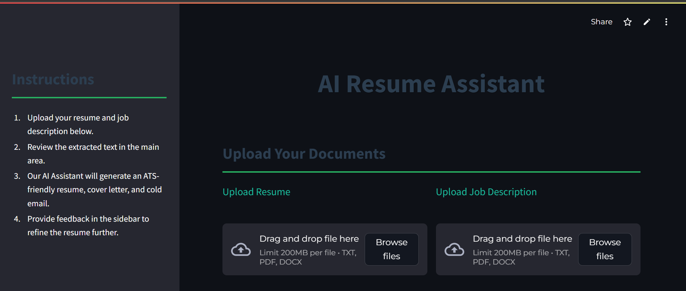
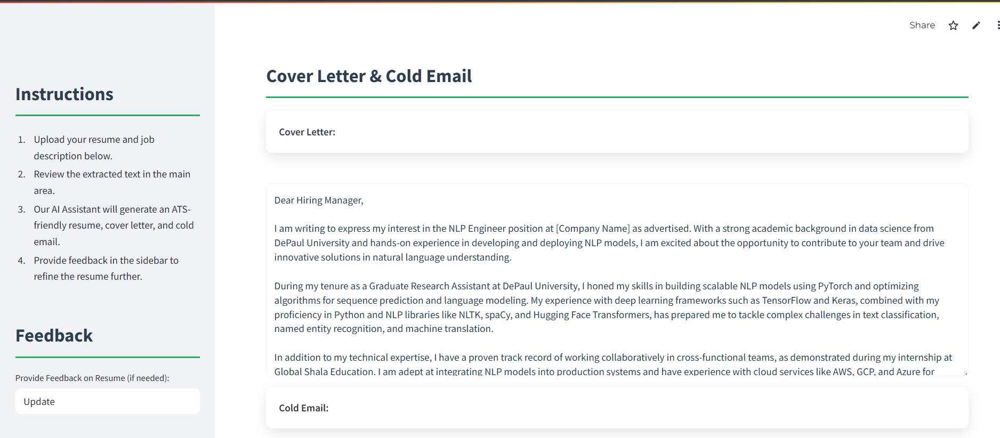

# 🧠 Agentic AI Resume Assistant
<p align="center">
  
</p>

<p align="center">
  
</p>

Generate a fully customized resume, cover letter, and cold email using LLMs and Agentic AI — in one click.

## 🚀 Features
- Multi-agent collaboration using [LangChain] and [LangGraph]
- LLM-powered generation (OpenAI / Groq / LLaMA3)
- Streamlit frontend for easy use
- Interactive feedback loop to refine outputs
- Future-ready modular architecture

## 🧰 Tech Stack
- Python
- LangChain / CrewAI
- Streamlit
- Groq API or OpenAI API
- dotenv for secret management

## 📦 How to Run
```bash
git clone https://github.com/nishantsingh-ds/agentic-resume-assistant.git
cd agentic-resume-assistant
pip install -r requirements.txt
streamlit run app.py
